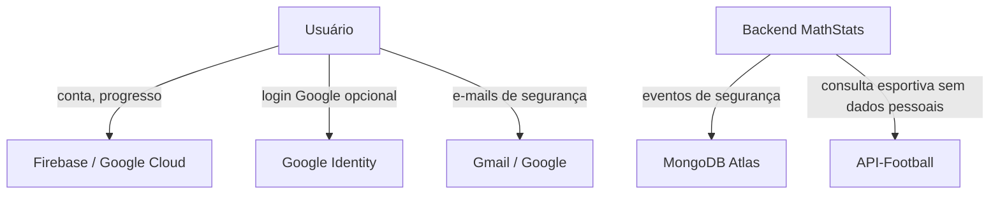

# Matriz LGPD — MathStats

Versão: 1.0 — setembro de 2026. Documento acadêmico do PFC, a ser revisado antes de uso público.

## Inventário e tratamento

| Dados                                                     | Origem                              | Finalidade                                                 | Fundamento documentado                                                | Armazenamento                                                       | Retenção                                                                          |
| --------------------------------------------------------- | ----------------------------------- | ---------------------------------------------------------- | --------------------------------------------------------------------- | ------------------------------------------------------------------- | --------------------------------------------------------------------------------- |
| Nome de exibição, username e e-mail                       | Cadastro ou Google Identity         | Criar e identificar a conta                                | Execução do serviço solicitado                                        | Firebase Firestore                                                  | Enquanto a conta estiver ativa                                                    |
| Hash da senha                                             | Cadastro ou criação de senha        | Autenticação local                                         | Execução do serviço e segurança                                       | Firebase Firestore                                                  | Enquanto necessário ao login; removido com a conta                                |
| Identificador Google                                      | Login Google escolhido pelo usuário | Vincular o método de autenticação                          | Execução do método de acesso escolhido                                | Firebase Firestore                                                  | Enquanto a conta estiver ativa ou até desvinculação futura                        |
| Segredo TOTP criptografado                                | Criação da conta                    | Segundo fator de autenticação                              | Segurança da conta                                                    | Firebase Firestore                                                  | Enquanto a conta estiver ativa; removido com a conta                              |
| Cookie de sessão                                          | Login                               | Manter sessão autenticada                                  | Estritamente necessário ao funcionamento                              | Navegador e memória do servidor                                     | Logout ou expiração de 15 minutos                                                 |
| Códigos de 2FA e recuperação                              | Fluxos de segurança                 | Confirmar acesso ou recuperação                            | Segurança da conta                                                    | Temporariamente no serviço e em hash no Firestore, quando aplicável | 15 minutos ou uso único                                                           |
| XP, ofensiva, tentativas, respostas e desempenho          | Uso dos desafios                    | Mostrar progresso e prestar a funcionalidade educacional   | Execução do serviço solicitado                                        | Firebase Firestore                                                  | Enquanto a conta estiver ativa; removido com a conta                              |
| IP, evento, data/hora, userId, username e detalhe técnico | Ações relevantes da aplicação       | Auditoria, prevenção de abuso e investigação de incidentes | Legítimo interesse de segurança, sujeito a avaliação no caso concreto | MongoDB Atlas                                                       | 180 dias, por índice TTL; identificadores e IP são removidos na exclusão da conta |
| Aceite de Termos e Política                               | Cadastro                            | Evidenciar apresentação dos documentos                     | Registro do fluxo de cadastro                                         | Firebase Firestore                                                  | Enquanto a conta estiver ativa                                                    |

Cada novo aceite registra separadamente `termsVersion`, `privacyPolicyVersion` e `legalAcceptedAt`. Contas anteriores à adoção de versionamento são identificadas como `legado-sem-versao`; o sistema não atribui retroativamente uma versão que o usuário não aceitou.

## Dados não coletados nesta versão

CPF, endereço residencial, geolocalização, imagem, voz, biometria, dados financeiros, dados de saúde e data de nascimento completa.

## Compartilhamentos

Firebase/Google Cloud, Gmail/Google, Google Identity e MongoDB Atlas podem processar dados em infraestrutura localizada fora do Brasil, conforme a região e os termos de cada fornecedor. A transferência deve permanecer limitada aos dados necessários para cada finalidade. No contexto acadêmico, a equipe do MathStats é a responsável pelas decisões de tratamento e atende solicitações em `mathstats.app@gmail.com`.

## Perfis e permissões

| Operação                    | Visitante | Usuário autenticado       | Backend                                 |
| --------------------------- | --------- | ------------------------- | --------------------------------------- |
| Ver documentos legais       | Sim       | Sim                       | Não aplicável                           |
| Dashboard, trilha e conta   | Não       | Somente os próprios dados | Valida sessão                           |
| Consultar/exportar dados    | Não       | Somente os próprios dados | Filtra por `userId` da sessão           |
| Consultar auditoria         | Não       | Somente os próprios logs  | Filtra por `userId` da sessão           |
| Corrigir nome de exibição   | Não       | Somente o próprio nome    | Valida sessão e tamanho do dado         |
| Solicitar oposição/bloqueio | Não       | Somente em nome próprio   | Registra solicitação vinculada à sessão |
| Excluir conta               | Não       | Somente a própria conta   | Remove usuário e tentativas associadas  |

## Direitos oferecidos na aplicação

- Consulta e exportação dos próprios dados.
- Visualização dos próprios eventos de auditoria.
- Correção do nome de exibição.
- Solicitação de oposição, bloqueio ou anonimização quando cabível; o pedido fica pendente para avaliação do responsável pelo projeto.
- Exclusão da conta e do histórico de desafios.

Alterações de e-mail e username não são automáticas porque exigem confirmação de segurança. Esse fluxo permanece pendente para uma versão futura.

## Crianças e adolescentes

O projeto adota minimização de dados, linguagem simples, desempenho privado e ausência de publicidade comportamental. Não haverá fluxo de vínculo por e-mail com responsável nesta versão, por decisão do projeto. Crianças e adolescentes devem utilizar o MathStats em ambiente acadêmico supervisionado. Solicitações de privacidade que não possam ser resolvidas pela área de Conta devem ser encaminhadas a `mathstats.app@gmail.com`.
